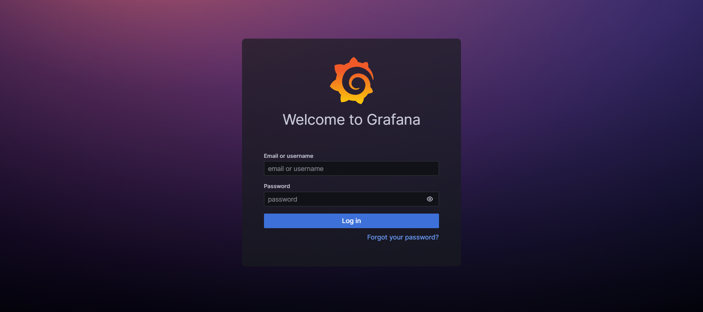
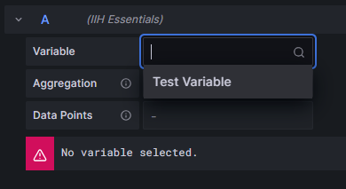
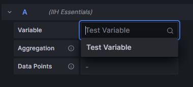
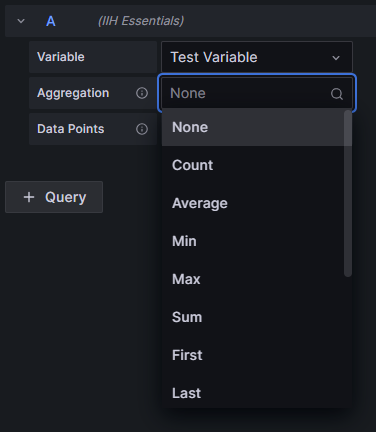
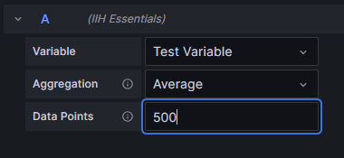

# Using Grafana to visualize your data

[Grafana](https://grafana.com/) is a visualization tool that allows you to display data from different sources.

This is an instruction on how to install the IIH Essentials Grafana plugin.

**Note:** This plugin is meant for development. No support for production use cases is provided. The software is provided “as is”, without warranty of any kind, express or implied, including but not limited to the warranties of merchantability, fitness for a particular purpose and noninfringement. in no event shall the authors or copyright holders be liable for any claim, damages or other liability, whether in an action of contract, tort or otherwise, arising from, out of or in connection with the software or the use or other dealings in the software.

## Table of Contents
- Installation steps
    - [Install Grafana](#install-grafana)
    - [Extract the plugin](#extract-to-plugin-folder)
    - [Restart Grafana](#restart-the-grafana-service)
- [Configuration of Grafana](#configure-grafana)
- [Usage in dashboards](#usage-in-a-dashboard)
- [Helpful links](#helpful-links)

## Install Grafana

In order to visualize the data from your IIH Essentials data service, you first need to [install Grafana](https://grafana.com/grafana/download?edition=oss).

## Extract to plugin folder

You can grab the zipped plugin (iih-essentials-grafana-plugin.zip) and extract it to the Grafana 
plugin folder. 

### Locating the correct folder

#### Linux:  
The plugin folder is usually either configured to be  
`/var/lib/grafana/plugins`  
or  
`/usr/share/grafana/data/plugins`

You can look into the logs `/var/log/grafana/grafana.log` to see where exactly grafana is searching for the plugins.

If the plugin folder doesn't exist, you can create it yourself.

#### Windows:  
The plugin folder is usually located under  
`C:\Program Files\GrafanaLabs\grafana\data\plugins`

If the plugin folder doesn't exist, you can create it yourself.

### Allow unsigned plugins (Linux)

As this plugin is not officially released and signed, you will need to tell Grafana to allow unsigned plugins. This can be done by editing the file `/etc/grafana/grafana.ini` and editing the variable *allow_unsigned_plugins* (typically found around line 1344) to contain the plugin ID `siemens-iihessentials-datasource`. 

### Configure permissions on plugin (Linux)

In order for the plugin to run, Grafana needs execution permissions on the plugin folder.  
If you created the folder manually, you will also need to grant those permissions manually.

To grant the necessary permissions, you can use `chown` and `chmod`:  
```bash
sudo chown -R grafana:grafana /var/lib/grafana/plugins
sudo chmod 754 -R /var/lib/grafana/plugins
```

## Restart the grafana service

For the plugin to show up, you will need to restart (or start if it is not already running) your Grafana instance.

#### Linux:  
```bash
sudo systemctl restart grafana-server
```

#### Windows:
- Open the start menu and type *Services* to open the service overview
- Find Grafana
- Click on *Restart* (or *Start* if it's not already running)

## Configure Grafana

Once Grafana is running it can be found under the [local port 3000](http://localhost:3000) if not configured otherwise. 
Once you open it, you will be prompted to log in. 
The default login data is *admin* and *admin* and should be changed immediately.



### Selecting as data source

To show data from the data service, the plugin has to be selected as a data source.
Open the side panel and open Connections and Data sources.


Press on *Add data source* and scroll all the way down to the *Others* section, where you will find the *IIH Essentials* Plugin.


Open the configuration page by pressing on it.

Change the name of the data source to *IIH Essentials* and insert the URL to your data service endpoint.  
(When you don't enter anything, the plugin assumes the data service is running under http://localhost:4203)

Click on *Save & test* and it should display a message indicating the successful connection.


Now you have enabled the plugin and can use it as a data source in your dashboards.

## Usage in a dashboard

When you first create a dashboard and select IIH Essentials as your data source, you will get an error because no variable is selected.

Open the [query editor](https://grafana.com/docs/grafana/latest/panels-visualizations/query-transform-data/) and select a variable to display. If the selection box is empty, you might not have a variable created in your data service.



### Other options

There are three configuration options when editing your query:
- Variable
- Data Points
- Aggregation

### Variable



The variable selection simply allows you to select which variable created in your data service you want to view in your dashboard.

### Aggregation



The aggregation defines how the underlying data gets bundled into the number of data points specified. The default is *Average*.  

### Data Points



Select how many data points you want to view. Please be aware that you will not be able to view data points with a time difference of less than one millisecond.

#### *Notes:*  
- If the aggregation *None* is selected, the selected number of data points doesn't apply.
- Grafana only supports queries of up to 4 MB. This should be enough for almost all use cases. Nonetheless, use with care.

## Helpful links:  
[Grafana | Introduction to Grafana](https://grafana.com/docs/grafana/latest/introduction/)  
[Grafana | Installing Grafana](https://grafana.com/grafana/download?edition=oss)  
[Grafana | Build your first dashboard](https://grafana.com/docs/grafana/latest/getting-started/build-first-dashboard/)
